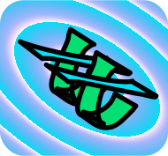
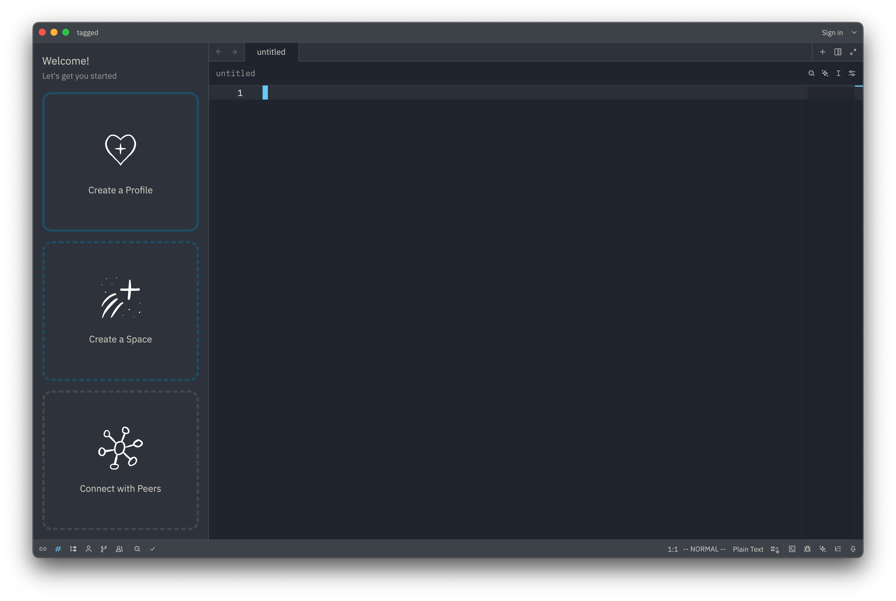
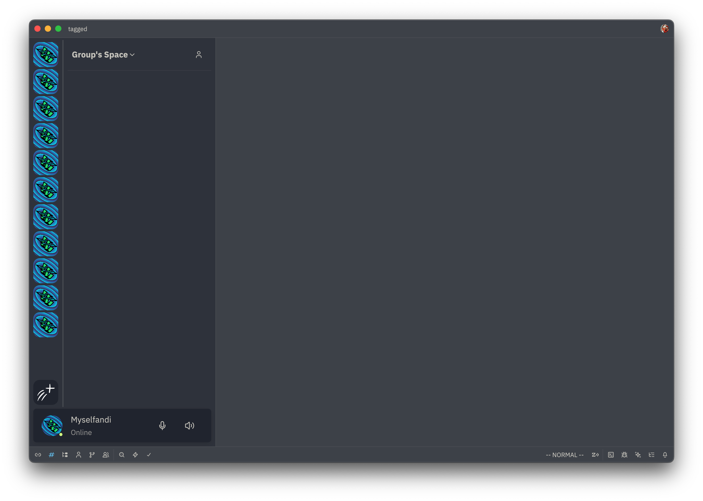

# Project: Tagged

An experiment, to figure out a way to put human beings back in charge of their own data.

> Right now, this is mostly just a shitty fork of Zed
>
> Please know that this is a passion project and is highly experimental. My motivation for
> this project is to find a way for human beings to take back control over our digital lives.
>
> I do happen to be looking for help from any whole-hearted humans who see the vision I see
> and want to help because they think it's the right thing to do. Between now and later, that
> will hopefully include some inspired Rustaceans and aspiring users. An express goal of this
> project is to be a powerful tool for local community groups to be able to organize with
> each other while protecting group data.

## Getting Started

This project is effectively a plugin to a fork of Zed, so you'll need to clone both
my fork of Zed and this project.

> The fork only exists to add a tiny change to Zed's app builder to allow it to accept plugins.
>
> I think this is super cool and I'd really like Zed to upstream it but they closed my PR :(

```
# Clone Zed fork
mkdir -p ~/git/github.com/nicholastmosher/zed
cd ~/git/github.com/nicholastmosher/zed
git clone https://github.com/nicholastmosher/zed .

# Clone this project
mkdir -p ~/git/github.com/nicholastmosher/tagged
cd ~/git/github.com/nicholastmosher/tagged
git clone https://github.com/nicholastmosher/tagged

# Run
cd tagged/crates/tagged
cargo run
```

## Project Vision and Values

Today, I see the centralization of software as a threat to democracy. In the last
few decades, we have allowed our core productivity tools to shift from the Desktop
to the Cloud. At the time, the appeal was a profound increase in the ability to
collaborate, such as multi-cursor editing in google docs. However, it came at the
cost of data ownership, privacy, and sovereignty, because the form-factor of Cloud
technology puts the data in control of the providers, not the users.

Consider the Browser, which is a marvel of technology. It is less of an application
and more of an application-platform. It's ultimately a program that can fetch content
from a network and render it to the screen. The content may be static, like a blog,
or dynamic, drawn by application code (JS/WASM) that itself is a form of content.
The Browser is the platform which provides the tools to draw on screen, make network
requests, play audio and video, and read/write to disk, and also takes on the responsibility
for isolating sites from one another to protect user privacy.

However, the greatest weakness of the Browser is that it fundamentally is only a **portal**
to view data that lives remotely on a server. When you use any web service, you're
not interacting with "your data" on somebody else's machine, you're interacting with
somebody else's data _about you_ on _their_ machine. Under this model, users are at
the mercy of application providers:

- Content that was once available to you may become unavailable
- Content that was once free may become paywalled
- Data that you consider private may be used by providers to train AI
- Data about you may be shared with arbitrary third-parties
- Providers may track your browsing and build a profile of you for purposes
  like targeted advertising or surveillance
- Your interactions with other users may be tracked and profiled
- In social media settings, the content you see is determined by the _provider_
  rather than by you, so people can be divided and isolated in bubbles.
- Content can be suppressed or boosted by providers, influencing public opinion
  and radicalizing users

The vision of this project is to create a next-generation application platform which
puts users in control of their data by using durable local-first and peer-to-peer
foundations. The spirit of this project is staunchly anti-capitalist, anti-fascist,
pro-democracy, and pro-sovereignty. Human beings should be able to use digital systems
while maintaining an expectation of privacy and anonymity, while also enjoying the
capabilities of live collaboration and group sharing.

## Leading use-cases

The first handful of use-cases I want to support are all things that would be useful in
local community organizing. I'd consider an essential toolkit should include chat, a
calendar, and shared document editing. I want a mental model similar to discord, where
there can be different spaces hosting content for different groups of users. I'd also
like for multi-profile support to be first-class, and have strong considerations for
privacy and anonymity built in.

So imagine a discord-style server sidebar and chat topics on the left, then the main
content window could be any kind of shared content. One goal of this project is to allow
for third-party plugins to add support for varied content types.

> TODO: Write more about social media and collaborative productivity suite

## Technical Foundations

I've been spending time in the last few years trying to learn the landscape of technology
that would be necessary to build something like this. Right now, the core stack I'm
considering is this:

- Desktop UI and platform: Zed / GPUI
- Peer-to-peer connectivity: Iroh, maybe libp2p, maybe modular
- Data store: Willow

> TODO: Write more about why I chose Zed and Willow as the basis for the stack

<div align="center">

</div>

> I needed an icon and this is what came out of me playing with Inkscape >:D
>
> I was going for a hash-looking thing, and `t`s for "tagged", and this came out
> also looking to me like DNA if you squint which is dope so for now I'm keeping it

# 2026 March 4

Screenshot from the start of today



- Need to develop onboarding logic and bind to UI
  - Fix duplicate item opening
  - One Item for onboarding? Or one Item each for Profile/Space/Peers?
    - Long term seems like each should have a dedicated page/item
    - Short term, might create a quick one-page solution
- Want to prototype with in-memory Willow store

# 2026 March 2

> pm

- Yesterday got a ton of progress on 2nd UI iteration
- But, I was using mock data and I don't have the 0 to 1 onboarding flow yet
- Going to try to implement the UI and flow to start from scratch
- I learned that there's an in-memory implementation of a Willow store! I'd
  love to try it out as the backend

# 2026 March 2

> am

Screenshot from today



- Did a lot of UI experimenting and reworking in the last few days
- Started from scratch with discord-esque interface:
  - Profile indicator at the bottom of the sidebar
  - List of spaces on the left bar with icons
- I've started to figure out a pattern for organizing different UI elements, it was
  pretty messy before:
  - `components/` is full of `RenderOnce`s, which don't maintain state over time.
    These are meant to hopefully be fairly reusable.
  - `scenes/` is higher-level `Render` views that pull many components together, and not
    really intended to be reused.
  - `state/` is where definitions for Entities with domain-specific data live.
    Maybe it'd be more classic to call this `models/` or something.
  - `willow/` for data-access APIs, intended to be a DSL over actual Willow machinery
  - Other stuff is still fairly disorganized

# 2026 Feb 25

Use case: Local organizing
Requirements / User story
- Some folks get together and want a digital space to collaborate on their work
- A trusted group member creates a new space and invites all the other members
  - (in a Willow implementation, this may look like generating a namespace keypair)
- Realistically, there would be an onboarding step here including convincing people to
  use this tool and helping everybody get it intsalled and joined into the group
- When opening the group's space for the first time, what does the user see?
  - Option: All the pinned feeds for the space
  - Option: A home canvas, which is like a dashboard that the space admins can set up
    to display notable objects, such as chat feeds, a calendar, significant documents, etc.
  - Option: A list of all the known members of the space, the public-facing Profile views
  - Option: A list of all the object types in the space, e.g. chats, documents, tags,
    feeds, photo albums (a grid feed), photos
- Need: A feed of local events and a way to collaborate on organizing it. Create a list
  of supplies, allow people to sign up to bring things. Create tasks and assign them to
  people.

---

- As an organizational tool, a first-class consideration should be how delegates may
  be assigned from a group to participate in another group/organization as a representative.
- Create a standard mental model for trust, but which can apply to arbitrary cross-sections
  of connections. For example trust in a gaming group would be different than trust in a
  local organization.

- Voting: Imagine a poll as an object type (perhaps) which can live in a space/directory
  over time. Imagine a timeline of events of the poll, such as each vote submitted.
- So you'd create a poll and maybe for a particular decision, you set an initial deadline
  where all votes would be tallied. Imagine this like a git commit chain where you'd
  "call" the vote by tagging a commit at a given time.
- However, leave the poll open and active after calling the vote. Allow for users in the
  future to update the poll, so new users can submit votes about a topic even after it
  was initially "called". So polls could be durable entities, which have a life span that
  allows opinions to be expressed and changed over time, verifiably.
- For example, ? in our society it feels like Federal power is greater than State power
  which is greater than Local power, in terms of perception. Imagine a society where this
  assumption was flipped: Local law is the supreme law of the land, with state and
  federal government serving just to provide standardized public services.
- The fundamental shift here is a mental one. Instead of authority coming from an external,
  third-party or distant entity, authority comes from within.
- Everything that exists is no more less real than anything else. Every human that exists
  does so under their own power.
- Peace is allowing everything to happen how it happens, without trying to force anything
  to be different than how it is.

# 2026 Feb 25

- Need to think of TODOs
  - Need to learn Zed/GPUI scrolling

- Today I discovered https://github.com/dirvine/p2p
- I think I was looking up p2p over ipv6
- Today turned into a learning day checking out dirvine

> In any serious conversation, you should always take the time to define any key elements
> of any word you use. Meaningful exchanges include the expression of the shape of any
> particular idea, but it's possible to get lost squabbling about the words we choose to
> name the ideas. We end up using one set of words, but having such different underlying
> definitions of some things that it means we're effectively speaking two different languages.

Users
Developers
Data
Capabilities

# 2026 Feb 24

- Need to write an intro and getting started and pin it to top of README

- I want to write more about the vision for the project
- Extensibility, data ownership, honest language shared between data and UI
- From my written notes yesterday:
  - Storytelling of tagged's purpose and ideas
  - I'm hoping to make data a first-class idea in the UI and mental model. Having a
    pretty and extensible "Object" viewer should set a standard and predictable
    way to think about key-value or list data.
  - It seems to me that all data is key-value, from an abstract point of view.
    Lists are just a case where the item's index serves as the key.
  - There are many different "domains" of key-value data that we think about
    differently due to setting, but which all seem able to express
  - > (this is where my notes trailed off, but I'll continue my present thoughts below)
  
- One key-value system we're familiar with is a filesystem. I want to start from here, in
  nice familiar territory, then expand on it.
- Fundamentally, a folders and directories based system is hierarchical, and may be
  described as a tree. As a tree, every folder might have zero or more children, the
  files and subfolders in the folder. (a tree is less general than a graph, to be continued)
- Even more fundamentally, the point of a filesystem is just to organize the total set of
  files on a digital system. It's the assignment of names to content, where the fundamental
  purpose is to find content by name. We then use the mental model of files and folders to
  help us navigate when we have too many files to think about at one time.
- Even more fundamentally from a human perspective, the way we organize ideas is influenced by
  our intellectual capabilities and limitations. One way humans think is by use of abstractions,
  where many ideas may be grouped together and given one name, therefore simplifying it.
  Abstraction helps us deal with the problem that we can only hold a few ideas in mind at a time.
  Loosely, thinking about 100 things is much easier if we think about them in 10 groups of 10 things.
- But ultimately the only thing a digital information system needs to provide is a simple and fast
  path for the user to find and interact with their data. Hierarchies (like folders) are but one
  way to allow for the thinking about groups of files at a time.
- However, hierarchies have a key limitation, which is that one file cannot be in two folders
  at a time. There are crude solutions to this like shortcuts or symlinks, but they're crude
  because they don't solve the limitation in the mental model, they're a hack, a technical
  solution to a mental modeling problem.
- I said folders are trees, this is true because any folder (or tree node) can have at most one
  parent. In computer science, we also talk about graphs. Like trees, graphs have nodes and edges,
  but there is no parent-child relationship, so there is no limitation that a "child" may only
  have one "parent". Graphs are strictly more expressive than trees, because every tree is a
  valid graph, but the opposite is not true. To bring this back into a user-language context,
  "tags" (as in a file explorer context) are an expression of a graph structure.
- I was thinking that like "folders" are the real-world analogue for nodes in a tree, for graphs
  a good metaphor might be **"stickers"**. You can have as many different designs of stickers as you want,
  and you can put any number of stickers on any files you own. Then, looking for files becomes
  a query for files with certain stickers.
- Alternate timeline name, sticky?
- I should probably get more familiar with the technical details about graph databases, especially
  querying.
- In terms of efficient database/datastore implementation, I do wonder whether a
  hierarchical system (Willow's Paths) would be considered higher-level or lower-level than
  a graph-based system? In other words, what would something like Willow look like if it used
  graph-based primitives rather than hierarchy-based primitives (Paths).
  It feels to me that the more expressive datatype (graph) would either want some special
  considerations during implementation that might influence the data model design, or might
  provide some significant benefits due to the increased expressivity.
  - It feels like I'm describing inodes
- Alternatively, what would it look like to implement a graph-based query system on top of existing
  hierarchical primitives? Interestingly... I think that GPUI's `Entity<T>` system already expresses
  a graph relationship.
- I wonder if adding a newtyping pattern on top of entities could be used for an easily-extensible
  custom-graph-node-type kind of API. For example, `struct ChatHandle(Entity<Chat>)`. I'm definitely
  imagining solutions to unknown problems based on remixing gpui patterns, but I'm pretty curious
  how extensible and composable the entity pattern could be made to be.
- I really want an interface that is simple and consistent in these dimensions: user interface,
  programming interface, and data model. 

Project vision (continued)

- A platform to give users full control and ownership over their digital lives.
- A dedication to simplicity, for lowering the barrier to entry both for users and for developers.
- A unification of terminology/domain across data, applications, and permissioning.
- A community-driven expansion based on composable APIs and protocols
- Built for power users _and_ everyday users. Allow multiple interfaces to the same system for accessibility.
- A dead-simple app should define 1 data type and a render function, and be able to show up in feeds.
- Feed-based interface. A feed is just all objects matching a query, rendered in a row or column.
- ? User-first control means that the app framework takes care of the standard data query langauge
  or interface. Apps are given a result set of objects matching the user's query, then render the data
- Privacy and anonymity as first-class considerations, both at the data level but also in UI.
- It should be easy to keep two identities separated, both for the purpose of locally seeing which data
  belongs to which profile, but also for being intentional about knowing which profile is interacting with
  particular content or groups. For example, being sure not to post a family photo to a public forum by accident.
- It should be easy to understand and use permissions! It should be easy to share content exactly to the
  intended recipients, and later to be able to view and check who has access to a given file or area.
- For now, a committment to being Rust-only. I think Rust's types and traits offer such powerful composition
  that trying to maintain a bridge to a more simplistic API style like C would severely limit the possibilities
  for building a platform. I look at Zed's codebase as more than enough confirmation of this. I can't even
  count how many new compositional patterns I've learned just from reading Zed's source, bravo Zed team

- I think there should be an audit-quality timeline view. A visual representation of every time your data
  was touched, from what application, and under what express or derived authority? (e.g. chain of capabilities)
- Reputation could be some kind of embellished view on top of a timeline. Imagine a kind of tag (or sticker)
  that users could slap on other profiles or actions taken by different profiles, like posted files.
  - I always have a gut feeling that any kind of reputation system would only be abused. But I also can't help
    but feel like a trusted community member should be able to sign objects, so that the trusted community's
    followers can find the files or the work
  - If a member signed a document, but edits were added later, should viewers see the signer as e.g. a badge on
    a document, but then also be shown a diff between the document at the time the member signed and the version
    that's currently being viewed.
- A multi-spacial view. Every "space" view must be able of rendering all objects in all of a profile's spaces.
  Then the user filters down with standard queries, and the view narrows down
- A single/multi profile viewer (mental model) that follows the Rust terms: you can read/write if you're
  exclusively using one profile, or you could have a read-only view over a shared pool of profiles. For privacy,
  you wouldn't want to attempt writing when viewing a multi-profile context, because you might accidentally expose
  a profille by writing with its identity into a space it didn't intend to.

- I want to get to contact persistence. I add somebody by ticket once and persist their Iroh Endpoint Id (to start)

---

- Canvass-like UI, like inkscape. It's a surface that can be scrolled around,
  and visual elements live on that space.
- Allow for pinning objects to a canvass, and providing visual data interaction
  tools, such as wires for a data stream.
- I have a gut feeling that I need to make the visual language center around
  addressing, so that the abstract data space can be more or less plugged into
  any other space that could be addressable. For example, write a git adapter
  plugin that allows addressing objects in the git filesystem, so they can be
  pulled into the overall data visualization. A plugin would just need to provide
  a way to render the content behind an address like a git hash.
- I've had this idea sticking around for awhile: A specialized search bar that
  is a kind of universal query bar, with support for searching by tags. When this
  search bar appears in a new place, users should automatically know what can
  be queried and how to do it.
- Brainstorming: Components I ~definitely know I'll need~ could maybe do:
  - Object widget (in progress)
  - Object canvass (scrollable space for objects, like inkscape)
  - Tag-based search bar
  - Object feed
  - Peer view (peer system view?)

- The most pressing problem I have no idea how to answer is that of discovery.
- Social media by corporations is problematic for many reasons but one of which is the
  fact that our discovery of each other is at the whim of the centralized controller
  of the platform.
- The goal is of course to move to a self-supporting distributed app platform, but
  how users discover each other or their content is currently something I have no idea
  how to solve other than by relying on connections being built out-of-band.
- I think a key element of the philosophy is that users should be able to control their
  own experience by installing plugins they like. So Discovery might be something
  provided by a plugin, or there might be one unified discovery API and then plugins
  could hook into an API that allows them to show suggestions for content.
- I think Bluesky and atproto take content discovery into account something like this

---

Willow shell?

- A typical shell navigates the user through a file space, a willow shell could navigate
  through subspaces and namespaces as well.
- Whereas a shell's significant state is what the current working directory is, a willow
  shell context would also include a range of subspaces

# 2026 Feb 23

> pm

- Maybe work on Object rendering
- Maybe work on cleaning up data modeling interface?
- Goal is an interface that allows one data definition
  to be used across UI and storage (and maybe remotes)
- aside: `trait ContentAddressable { type Address; fn address(&self) -> Result<Self::Address>; }`
- Some UI trait describing typical CRDT workflows, to auto-translate CRDT operations
  (abstractly/generically) into UI wrapping/decoration
- Try to make a glue between UI and data that makes a visual language for data

- Note to self: Don't instantiate UI items repeatedly in `render`

# 2026 Feb 23

> am

- Working on ObjectWidget
- Want to make a generic interface to bridge with CRDTS
  - Get live dynamic rendering of CRDT data
- For now just to get rendering sorted, using serde_json::Value

# 2026 Feb 21

- Term idea: Create a "lens" of a particular object type at a directory
- The lens sticks around like an object and lets you view that directory
  as that object quickly. Imagine the lens being tagged or pinned.

---

- More chat work
- Need interaction path from Profile > Namespace to > Create chat and then
  to open ChatUi item
  - Let's hardcode it for now and return later to generalize

```rust
/// Project from the Zed:Entity space to another space (like Willow Objects)
impl SomeExt for Entity<T> {
    type Handle<T> = ()
    fn to_other_handle<T>(&self) -> Self::Handle<T> {
        // pass the entity to the new handle type
        Handle::new(self.clone())
    }
}
```

```rust
// Zed already has:
pub trait ItemHandle: 'static + Send {
    // things in here can be domain-specific behavior as long
    // as it can be accomplished via an `Entity<Self>`
}
```

# 2026 Feb 19

Todo

- Chat use-case
- Need to instantiate new chat. How to go from 0 to 1 chat-feed objects?
- Profile > Space > Directory-to-chat-data > chat room (feed) id > objects
- In Path view, at the bottom in a dashed rounded box (like ButtonInput),
  have row of "create object" buttons, based on the object types registered
  by all installed plugins.
- Bet

# 2026 Feb 18

How about: a tour of the codebase and a quick story about how this started
and how far it's come.

Firstly, the way I've been conducting this project is to just make a crate
and jam on it, trying experiments and iterating design attempts and going
with the flow. I try not to interrupt an idea when I'm having it, so if I
eventually hit a dead end, I'll just create a new crate to act as the top
level app. But GPUI kind of makes this into a strengh as well, because I
can keep any successful reusable components, such as UI elements.

> future me: I got into the conceptual weeds, but I wanted to mostly point
> out which code is recent and which is older:
>
> - `crates/tagged`: The (as of now) most recent iteration, and looking to
>   become top-level app integration point. I'm thinking that `tagged` is
>   a good name to stick with, I'll have to see if there's any reason not
>   - However, this one started out called `iroh-ui`, and was an iroh-heavy
>     experiment. Iroh worked pretty well! Relaying works out of the box,
>     but mdns still didn't work for me. I think I've messed up some local
>     network setting by installing things like docker and VMs.
>
> - `crates/willow-api-derive`: This one needed to be a separate crate due
>   to being a proc macro, but I didn't end up actually needing it yet. I
>   left the crate just to be a set-up scratchpad for when I do need macros.
>
> - `crates/libp2p-ui`: I was investigating `libp2p` as a potential p2p
> solution, but it felt a bit clunky to use its API in GPUI, so I dropped it.
>
> - `crates/iroh-automerge`: This was the first time I'd played with Iroh,
>   but I think I also didn't know what I was doing with GPUI yet, so I was
>   getting bogged down trying to do p2p but not knowing how to render what
>   the state of everything was.
>
> - `willow-rummager`: I think when I first made this repo was back when the
>   Willow crew was talking about doing a general-purpose explorer-type app.
>   I don't want to step on their toes with naming though, so I've decided
>   to name this app something different.


Ok, so I'll say I've been thiniking about this project for several years
now, but until about one year ago, I'd mostly felt that I didn't have good
enough foundations in all the tech that'd be needed. So I've been trying to
follow and learn over time, checking out different p2p, crdt, and UI crates
over the years.

So sometime last year, I started really diving into Zed's source to try to
learn about it. I'd been using Zed for some time and was highly impressed
with it, and the codebase is spectacular and makes me appreciate the project
that much more. The base patterns established by GPUI are so buttery smooth
to work with: when I'm creating a component, it's starting with a rectangle
and dividing inward. Using a tailwind DSL as the styling system was such a
brilliant move, it's so easy to make "good enough" UI by just chaining a
bunch of calls together.

At some point, when I was poking around `App` to see how it worked, I noticed
that the base structure of GPUI is essentially the same as Bevy's, where there's
one central `App`, and all of the app's state and behavior get installed to it.
In Bevy, they talk about how almost all of the functionality of the game engine
itself is defined as plugins, rather than being baked in as a native or intrinsic
behavior of the system. I think Bevy's entity system and scheduler are two
examples of "inherent" `App` behavior. I have definitely thought a lot about
whether it could be possible to make Bevy and Zed compose with each other, though
I haven't figured that out yet.

One of the great things about `Bevy`'s plugins is that they can be published as
crates, and installed into other applications. For example, a camera control
library could be written once but used in many applications. So there becomes an
inherent incentive for the community to build and share plugins, because it
raises the ceiling for future projects because of being able to reuse prior
solutions.

How does Bevy's composition work, and then what is similar about Zed's patterns?

In Bevy, a small app might look like this:

```rust
use bevy::prelude::*;

fn main() {
    App::new()
        .add_plugins(DefaultPlugins)
        .add_plugins(TagPlugin)
        .run();
}

struct TagPlugin;
impl Plugin for TagPlugin {
    fn build(&self, app: &mut App) {
        app.insert_resource(NextTag(0.into()));
        app.add_systems(Startup, startup_system);
    }
}

#[derive(Component)]
struct Tag(u64);

#[derive(Resource)]
struct NextTag(AtomicU64);

fn startup_system(mut commands: Commands, next: Res<NextTag>) {
    // Create a first tag entity at startup
    commands.spawn(Tag(next.next()));
}
```

I personally _love_ Bevy's API, I've been being inspired by it for years now,
even though I've really never done an extended project with Bevy (lots of tiny ones).

So let me point out some patterns I think are super neat and deceptively powerful.

- The `App` is a container where all of the state and behavior live.
  - Imagine an infite filing cabinet, with a way to put or interact with things
    in each drawer.
  - Each drawer is an Entity, and each drawer may have zero or one Component of any type.
- There are two notable kinds of state management, Resources and Components.
  - There may be more, my knowledge of Bevy is very incomplete
- Resources are single values, and are looked up by their type. They are effectively
  the same thing as Zed's `Global`s.
- Components are pieces of data that can be attached to an Entity. Component data
  is stored in some internal representation within `App`.

- (some of) Bevy's behavior is expressed as "Systems", which are functions that run
  once per frame of the game (or some schedule).
- Systems use the "magic function" pattern, which can be seen elsewhere such as axum
  and actix-web. In Bevy, systems are just functions, and they define inputs and outputs.
  The cool part is that by changing the shape of a system, such as by adding another
  expected input, the App API `.add_systems(magic_function)`, through some trait magic,
  will effectively derive a plan for querying the inputs you asked for from the central
  App state (the `World`, in Bevy) and passing those inputs to your system when it's
  time to run.

Ok, so to summarize, Bevy has a bunch of cool APIs that allow for installing state and
behavior into the `App`, which then schedules and executes that behavior, calling the
magic system functions with references to the data it queried by just defining its own
inputs. In one little API, there's separation of state and behavior, composition of
common behavior as Plugins, and the ability to control the scheduling of the behavior.

Now, let's look at what we see in Zed:

Zed also uses what I like to call the "Global Context" pattern, because it has an `App`
and all of the state and behavior of the application get installed into it. Unfortunately,
Zed is lacking a Plugin API, and therefore has what I consider to be a composition
problem. I'll talk more about that later, but TLDR I have a fork of Zed which is very
minimal but completely solves the problem and unlocks the composition I want.

So what does Zed's state management story look like? It has two primitives (that I know),
which are `Global`s and `Entity<T>`s. As I mentioned before, Zed `Global`s are about
equivalent to Bevy's `Resource`s in that up to 1 instance of any type held in the context.
`Global`s and `Resource`s also each provide APIs that use the _type_ of the singleton state
stored in the context. In other words, they both offer access by type-lookup.

`Entity<T>` is the solution for storing zero-to-many instances of a kind of state. The
only requirement is `T: 'static`, consider it to be living in a hashmap where `Entity<T>`
is the key.

One of the key units of behavioral composition in GPUI happens when you have an `Entity<T>`
and know traits implemented by `T`, such as `Render`. When this is the case, the `Entity<T>`
handle can be used directly as a visual object.

Let's jump into some code to see how it works. In this codebase, I'm depending on my fork
of Zed where this is possible:

```rust
fn main() {
    Application::new()
        .add_plugins(zed::init)
        .add_plugins(tagged::init)
        .run();
}
```

This effectively allows me to build in a GPUI app that is
- 1) the entire Zed application (GPL3! <3), and
- 2) additionally whatever I stuff into the `App`.

The typical Zed "plugin" starts with `fn init(cx: &mut App) {}`. For most of my experiments,
I've wanted to be able to create custom UI, and the best starting points for me have been
to implement the Zed `Workspace`'s `Panel` and `Item` traits. Panels live in the side or bottom
docks, including views like `ProjectPanel`, `CollabPanel`, or `OutlinePanel`. Items fill the
main content window, like when you open a file to edit in Zed.

For this example, I'll show how to make a custom Panel, then how to integrate it into `Workspace`
using it's already-existing APIs, no modification to workspace source needed.

```rust
use gpui::*;

fn init(cx: &mut App) {
    // To instantiate a new Entity, we use `cx.new`.
    // The returned value is the Entity handle that we can use to look up or edit that state later.
    let chat_ui: Entity<ChatUi> = cx.new(|cx| ChatUi::new(cx));
    
    cx.observe_new({
        let willow_ui = willow_ui.clone();
        move |workspace: &mut Workspace, window, cx| {
            let Some(window) = window else {
                warn!("WillowUi: no Window in Workspace");
                return;
            };
            
            // Add panel to Workspace, then immediately toggle it open
            // Note: It appears that Workspace panels are limited to one per type
            workspace.add_panel(chat_ui.clone(), window, cx);
            workspace.toggle_panel_focus::<ChatUi>(window, cx);
        }
    });
}

struct ChatUi {
    focus_handle: FocusHandle,
}

impl ChatUi {
    pub fn new(cx: &mut Context<Self>) -> Self {
        //
        Self {
            focus_handle: cx.focus_handle(),
        }
    }
}

impl Item for ChatUi {
    // ...
}
impl Focusable for ChatUi {
    fn focus_handle(&self) -> FocusHandle {
        self.focus_handle.clone()
    }
}
impl EventEmitter<PanelEvent> for ChatUi {}
impl Render for ChatUi {
    fn render(&mut self, window: &mut Window, cx: &mut Context<Self>) {
        div()
            .child()
            .child()
    }
}

// There's some more to this example to make it work but this is a good illustration
```

So while Bevy and Zed have several distinctions and specializations to their domain,
their pattern of composition is (in an abstract way) very similar.

- They each embed their state in the "global context" (`App`)
- They each have a lifecycle and call the installed behavior on-demand
  - For Bevy this is a runloop, as a game engine, but
  - For Zed this is more like a Browser-style element tree with event
    propagation and callbacks.

There's a lot more to talk about with regard to the development experience from
within Zed, all good things. The design choices make it such a breeze to visually
design a representation of the inner state, while Entity handles allow for a cheap
and flexible way to pass state between contexts or to new components.

---

- Split Profile, Space, ButtonInput, ObjectWidget to separate modules
  - GPUI is so good at composition

- Chat as an instantiation of a more general feed, maybe `Feed<Chat>`
  - Feed could provide container-level common behavior, such as scrolling
    or animations.

---

- Portable private key, e.g. yubikey, allows logging in to any peer's
  "browser". The private key can generate the public key, and then perhaps
  there's a p2p layer that indexes nodes on the network according to their
  key and then allows lookup of any nodes hosting your key's content.

- So effectively if you leave your home computer on, and go to a friend's
  and use their laptop and the yubikey, you'd expect to find a path to your
  home node, or potentially any node that may be replicating data belonging to
  your key.

- Imagine your family's nodes have a "pull" permission to replicate a
  designated "backup" folder (or tag of folders) of yours, without you needing
  to give them any access to the contents.
  - Logging onto a new node via yubikey could sync the nearest copy of your
    namespaces to you.

---

- Need to do some solid coding, I have enough ideas to work with
- Contacts & Chat UI (peers/nodes UI?)
- Simple impl of Willow store API in-memory for testing? Would be nice
  for testing UX to actually be able to e.g. make profiles and entries.

- Thinking of using `.home/` as the convention for meta files, for a
  directory, or maybe `.here/`? so e.g. `.home/schemas/chat.schema.json`,
  or `.here/capabilities/chat.json`
  
  > slightly later me: I do quite like `.here/`

- I want to consider UI implications of read/write/pull

# 2026 Feb 17

Experimenting, notes

- Using a Bevy-style Query to represent a Willow query across the given
  namespaces, subspaces, and paths. The names are bikesheddable but the
  patterns are what's interesting.

```rust
fn init(cx: &mut App) {
    cx.willow().read(
        // Like gpui callbacks pass &mut App (or Context) to everything, do
        // we have a need to provide a "willow" context?
        // 
        // Oh wow, this could be really cool. So `Query<(...)>` describes the
        // search area for lookup in Willow, e.g. choosing one namespace and
        // one user subspace, and some path prefix. The `WillowCx<Datatype>`
        // 
        |
            query: Query<(Namespaces<(...)>, Subspaces<(...)>, PathPatterns<(...)>)>,
            willow_cx: &mut WillowCx<DataType>,
        | {
            // this can happen whenever Willow finishes IO for the query
            for entry in query.iter() {
                let ns = entry.namespace();
                let sub = entry.subspace();
                let data: &DataType = entry.data(willow_cx);
                let data: &mut DataType = entry.data_mut(willow_cx);
            }
        },
    );
    
    // Second attempt:
    // 
    // Bevy-inspired query API for interacting with Willow entries
    cx.willow().query(
        //
        |query: Query<
            // Data type portion of query
            Photo,
            // or, for example, to select multiple matching patterns:
            // Any<(Photo, String, Contact, Calendar)>
            // Automerge
            // Automerge<AutoSurgeonDerivedType>
            // IrohDoc<SerdeDatatype>
            
            // Search area portion of query
            (
                Namespaces<(/* list of type tokens for hardcoded namespaces? */)>,
                Subspaces<(/* list of type tokens for hardcoded subspaces / user keys */)>,
                Paths<(/* list of type-encoded paths or path patterns*/)>,
            )
            
            // It really seems to me that the only kind of subspace or namespace searching
            // /filtering capability you'd need would be "select from this list". 
            // But maybe with the ability to do any/all compositions on those lists
            // 
            // So e.g. the user looking at a search bar, could add a search fragment to
            // describe looking for entries which are located in any of a list of namespaces,
            // or subspaces, or path patterns
            // 
            // Need to think about whether that's actually useful, or whether it makes more
            // sense to have a runtime representation of queries, to accept dynamic lists of values
        >| {
            
        // Ooh, maybe the query callback can happen quickly by kicking off work in the
        // background, and just returning handles representing access to those objects?
        for photo: WillowObject<Photo> in query.iter() {
            //
        }
    });
    
    // Dynamic Area construction, rather than attempting via type composition
    let area = Area::new((
        Namespaces(vec![...]),
        Subspaces(vec![...]),
    ));
    // Even simpler
    let area = Area::builder()
        .with_namespaces(vec![..])
        .with_subspaces(vec![..])
        .build();
    cx.willow().query(area, |query: Query<Photo>| {
        //
    });
    
    // Fire a callback when any matching-typed object in the given area is created or modified
    cx.willow().observe(area, |query: Query<Photo>| {
        for photo: &Photo in query.iter() {
            //
        }
    });
}

#[derive(WillowObject)]
struct Photo {
    #[willow(path = "img.png")]
    data: Vec<u8>
}
```

---

Top-down time, UX brainstorming:

- Use-case: Chat
- Chat's unit visual object:
  - Profile name
  - Profile key
  - Profile icon (maybe default to key-derived generated?)
    - Oh! A functional, maybe styled QR code with the public key encoded?
    - Use as some kind of iroh ticket, passed by QR
    - Would want a toggle view, with default displayed not including any
      sensitive information, if anything.
  - Chat icon, one chat is probably one directory in a namespace, and whose
    chat-objects are written as entries in that directory. Possibly
  - Consider how to namespace schema definitions, would be useful to be have
    easy stable addresses to schemas 🔥
  - Feed: Needs to display some context like chat name, icon, status(es)?
    maybe custom styling
  - Feed visual objects: bubble-renders of chat data-objects, each bubble is a
    single message, maybe display sender or read status or whatever else
  - Send interface, text box and buttons. Consider multimedia now? Sigh
  - How to represent "others" (remote profiles? friends, contacts, connections)
    - Visually: face bubbles in chat?
    - As an object: `.receipts/{mary,jane}/{fields}`
  - I open a chat in a namespace. Where do I see known others in this chat?
    - Contact feed, next to the chat feed
    - "Space" interface is just a space full of feeds? Feed of profiles, namespaces,
      paths, tags.
  
- As an early user of this data space, what prefixing conventions would be good
  to establish? Want to be a good citizen and not make dumb choices people will
  need to live with forever.
- Right now I want to put app data in like `/apps/{app_name}/{here}`, because in
  Willow that path will also exist per-user and per-namespace, so in a way we
  already have a fairly globally unique prefix to our "root" directory.
- How easy or hard would it be to show the difference between:
  - This is a file in my namespace/profile-subspace that I'm editing, vs
  - This is a file in another namespace or profile-subspace that I happen to have
    the capability to use?

- Handle called Peer representing an online, syncing store of p2p protocols?
  - Allow instantiating multiple IO-unique peers in one process? Seems counter
    to the in-memory composition style going on, but still maybe
- "Peers" become another standard tag used for searching for feeds of objects.
  - Local peer: Shows only data that is persisted locally
  - All peers: Shows all the data we _know about_, e.g. we keep an index of files
    that may be in namespaces that we have read capabilities for. We could show a
    view where all local/saved/here objects are opaque and bold-colored, and remote
    ones are somewhat greyed-out or otherwise visually distinguished.
  - Tag queries could include:
    - All document between these three peers

- Namespace creation needs to have owned/communal from the start

- Bevy-inspired Asset interface?

- Per-profile "user styling" data object that's like a definition for how your
  profile should be rendered to other people. Like a specific purple glow rendered
  around all data objects associated with you. Custom shaders?

Data Spaces

- In-memory, in-application
- On-disk, over-wire
- REMOTE? FOREIGN-PEER OBJECT HANDLE?

What if it were possible to have an abstraction that treated in-memory and on-disk
objects with the same fundamental interface? `Entity<T>` handles are a delightfully
simple interface for interacting with app state. I'd like to make a similar handle
API for "on-disk" access (implemented as a Willow store), and if possible find a way
to compose the API of the two handles, ideally with the same handle type.

Down-the-line thought: physical storage, first-class replica management
- Replica: A remote peer that you have entered into a replication agreement with
- Probably implemented as some standard kind of capability (e.g. into a well-defined Area)
- Need user-facing terminology for remote interactions. And visual convention

- Workspace-item: Render a "space" as a sort of open canvas for feeds and object types.
  Could eventually extend to games, etc.
- API for plugins: Submit an object schema and path to the app, get rendered into the
  user's space as data objects integrated into existing feeds, or as newly-opened feeds
- Subject to standard query language, this becomes something users learn to apply to
  everything (tags, namespace/subspace or space/profile, paths)

- Need to figure out a first-class relationship between Willow and CRDT systems. I want
  first-class instant collaboration from CRDTS. I wonder if Willow would serve the purpose
  of namespacing and "addressing" a CRDT document, which could be represented as another
  custom handle type? When in an active session, the object is represented by a "CRDT handle"
  which might interact with it's "Context" which provides the machinery for sync and state
  managment and live collaboration.

- Want first-class consideration and integration of a reputation system, something that
  would maybe be useful for local organization purposes? Would be a target for abuse,
  might render it useless immediately

- Proxy render API as serializable DSL to host API-compatible interface inside WASM
  context, boom remote-portable apps

- Capability schemas??

- Make a UI dedicated to communicating how suspicious a requested capability is? For exmaple,
  assuming capabilities are first-class objects that users are familiar with handling, apps
  might request access to certain directories of the user's space.

- UI exercise: Need to practice distinguishing owned/communal namespaces. This matters
  very first thing in namespace (discord server) creation. Should probably heavily favor
  owned namespaces, I think I'd consider a communal namespace to be 

- Zed/GPUI: How hard is it to launch a program that's a handler for a file type? Just become
  a proper file explorer

---

- Thinking about how to display other users belonging to a mutual namespace
  - This is distinct from how to display multiple profiles controlled by one user
- If navigation is Profile > Namespace, in the namespace context it should be possible
  to view other (foreign, non-local) profiles which have participated in or have access
  to the namespace.
- Should capabilities be written to a standard directory in a namespace? Should there
  be a standard namespace index of participants?

- Need to think of a visual convention for Capabilities. I think they're easily just an
  instantiation of a "WillowObject" (as in earlier), so just a key-value object.
  Thinking rounded table window or bubble, with color-coded key/value cells and maybe a
  visually distinct rendering per data type, could be made generic and extendable.
- API: `trait ObjectLike` (name bikeshed), with `#[derive(ObjectLike)]`,

```rust
#[derive(ObjectLike)]
struct ProfileObject {}
```

- Network 

# 2026 Feb 16

- Calendar was a good thought experiment, but I think I need to pursue chat as
  a first motivating use-case to deliver.
- Navigation for Chat:
  - Open Profile
  - Open Namespace
  - optional: Open default chat for namespace?
  - Conveniently show directories with chat-compliant schemas?
  - Open a Path with a schema* matching the Chat objects
    > *I think it's fair to apply the term schema to a directory. Filesystems and objects are
        both key-value constructions. If a schema of an object can describe a mapping of
        unique field names to the types expected for the values, then a schema of a directory
        describes a mapping of unique paths to corresponding files and the expected format of
        those files.
    
  - Convention?: `.types/chat.schema.json`
    - `.types` as local directory convention that is specially recognized by Willow to
      describe/store the contents of a directory through the potential lens of many kinds
      of object. So different schemas in the same `.types` could describe a particular
      composition of fields into an object. A schema would act as a lens into the directory
      contents, so with careful design, directories/objects could be made to have strategic overlap

- UI design note: Standardized colors applied to object fields of primitive types
  - E.g. green for strings, blue for objects/enums

- UI design idea: Special "object" component that's just a little rectangle bubble table
  with a display of the object's keys and values. Could be made to have standard navigation
  through keys and lists, make objects predictable and understandable to users.
  - In an app (as a gpui plugin), define data types that have Render implementations, and
    associate those objects with a Willow object schema/handle, so the UI becomes a tangible
    and predictable interface to data objects.
  - Made to be a new-window component?

- An "object" as a directory in Willow may be uniquely identified by a
  (namespace, subspace, prefix) tuple
  - Object schema could either be explicitly given by the tuple, or implicitly identified
    by convention encoded in files, e.g. `.types/calendar.schema.json`
  - (namespace, subspace, prefix, schema) as a conventional unit may eliminate the need
    for special-casing schemas into the data model

---

Willow API: abstraction to generalize over "handles" to data. In the GPUI case, the handle
to a T is an `Entity<T>`, other handle kinds could include keys to maps.

```rust
trait ObjectHandle {
    type Context<T>;
    fn read(&self, cx: &mut Self::Context<T>) -> &T;
}

impl<T> ObjectHandle for Entity<T> {
    type Context = gpui::Context<T>;
    fn read(&self, cx: &mut gpui::Context<T>) -> &T {}
}

impl<T> ObjectHandle for WillowObject<T> {
    type Context = WillowContext<T>;
    fn read(&self, cx: &mut WillowContext<T>) {}
}
```

Here, `WillowContext<T>` represents an "open directory" which has maybe done schema
validation to ensure the directory fits the shape of the given `T` data object.

---

Random thought: The fully generalized App is the holy grail of abstraction. The
key problem is how to make an app without any intrinsics, and allow plugins to
somehow submit first-class app state (e.g. the entity system should itself be a
plugin). Fully generalized I suppose would mean that the App starts completely
empty, with no state and no API. Plugins would somehow provide all building
blocks to the global context, including inherent state like direct fields. The
way I'm imagining this is something like:

```rust
struct App<T> {
    intrinsics: T,
}

// here, universal T works with any instantiation of App
fn do_something<T>(cx: &mut App<T>) {}

// here, we require the app given has a particular necessary intrinsic, provided by a plugin
fn do_something_needing_entity_system(cx: &mut App<T>)
    where App<T>: EntitySystem
{
    cx.new(|cx| ...);
}

fn main() {
    // instantiate an App with intrinsics using a tuple
    App::new((
        EntitySystem::new(),
        WillowSystem::new(),
    ))
}

// I _think_ this API would require some kind of extractor pattern, which would
// allow the App to "pick" a given system out of the tuple of systems. I think
// this could be done but I haven't succeeded with it yet
```

---

Bigger picture: Roadmap and design

- Need plugins/apps for use-cases:
  - Chat
  - (maybe email UX for long-form)
  - Calendar
  - Documents,
  - Filesystem explorer,
  - Profile/Space management,
  - Peer network,
  - Storage,
  - integrate with Zed Settings
- UI considerations
  - Make objects first-class, make it clear that app's components are just
    direct renderings of data

# 2026 Feb 15

Random Brainstorming

- Thinking about a WillowContext API, analagous to gpui's `Context<Self>`
- GPUI Entities are well-typed handles to a piece of state, which happens to be
  held in memory in EntityMap
- A similar thought-pattern in Willow might be that a WillowObject is a "handle"
  (representation) of a key-value object model, which happens to be implemented
  as a list of Willow Paths to entries.
- So `WillowContext<Self>` might come from `willow.namespace(...)` or ...
- How about this: an object handle is like a schema and materialized view at
  the same time. It's like a query over a pattern of keys, which are used as
  the "fields" of the object.
- In reverse, the way we'd actually end up using it would be like this:

```rust
#[derive(WillowObject /* bikeshed name */)]
struct ProfileObject {
    // where `path` is some DSL for /path/{patterns}
    #[willow(path = "avatar.png")]
    avatar: Image<Png>,
    #[willow(path = "name.txt")]
    name: String,
}

fn init(cx: &mut App) {
    // experimenting query DSL, this would represent iterating/streaming over
    // a result set of objects
    let profiles: Vec<ProfileObject> = cx
        .willow()
        .user(/* User query API */)
        .namespace(/* Namespace query API */)
        .prefix(
            // Path query API
            "/apps/willow_object_app/profile_objects/"
        )
        // if the query is choosing from the set of all objects in the full willow space,
        // then a "projection" is a handle that represents that selection of objects
        .project()
    
    // impl ProfileObject {
    cx.willow()
        .query(/* Some Query representation */)
        // Note: Wouldn't this API need to handle a result _set_?
        // feels very Bevy
        .write(|this: &mut ProfileObject, cx: &mut WillowContext<ProfileObject>| {
            // Like gpui's Entities would have access to the App API,
            // we provide an API with necessary operations during write time
        }) // analagous to gpui's -> Subscription
    // } // end impl ProfileObject
}
```

In this API design, you can imagine the Willow Space as the set of all entries (key/value pairs)
in all namespaces and all subspaces (users). The problem the API needs to solve is for querying
and rendering objects from the filesystem into memory, and then allowing for attaching behavior.

So GPUI specifies Entities as handles to stateful objects (which happen to be stored in the
global context `App`), where those objects may specify
Similarly, Willow "objects"/entities would be handles to stateful objects (where the "fields" of
the object are a set of paths into a willow path space (namespace/subspace)).

We could implement traits for those objects, like how we have `Entity<State>` and `impl Render for State`
in GPUI, on the Willow side (continuing with the `ProfileObject` example above), we might have
`WillowObject<ProfileObject>`, which would be a handle that acts as an API over the set of objects
in the actual Willow Space (/store). Just like an `entity` needs access to the global context (`App`)
to read or write itself, so too would the `WillowObject` need access to the Willow store in order
to read or write or iterate through objects in the Willow Space.

- Willow Store as the term for on-disk representation, Willow Space as the in-memory application space?

Willow App: an application which can use user-keys and/or capabilities to read or write data into a
Willow Store. For example, a Calandar app might have an app key (which is just a user key used by
an app), and when using the calandar, you issue a capability for that Calendar app to come look into
your userspace, but restricted to the Area under a specific Path prefix, such as `/apps/calendar/`.

---

Case study: Calendar

I want to plan and implement a usable and useful calendar app, where I'll attempt to create a
daily-usable calendar app based on the Willow data model. I'll try to consider and express 
the concepts of namespaces and subspaces. I think the user-facing language I'd like to use in the
app's expression of the data model would be "Spaces" for namespaces and "Profile" for subspaces.

- In some way this would be a UX experiment of a "user friendly instantiation" of Willow's parameters's names.

The app experience should visually emphasize a sharp distinction between different Profiles, and
express a boldness in the presentation of signatures on signed objects or data. I want to make an effort
to visually directly expresss all of the Willow core concepts, because I think it's a great model to
build trust on and I think this can be made to be beautiful and powerful.

So significant but consistent representation of e.g. tags and signatures and data objects visually.
I'm actually now thinking to really lean into Objects as a central term. Imagine the fundamental principle
of the UI is that we have feeds of objects. A feed takes the objects of a given query and renders them
according to the objects' plugin definition.

> Slightly later me is thinking twice about using the unqualified term "Object".
> Need a term that is cohesive and fits both the user's mental model as well as has a direct correlation to
> the Willow fundamentals

So an "Object" Api here should have a graceful integration of the GPUI visual entity system and the Willow
data model API. Ideally these could be the exact same definition, e.g. a struct, which both exists as in-memory
state in the gpui EntityMap and whose type also expresses the relationship between the in-memory representation
and the in-willow expression of the object.

So an app that is a bare minimum chat room, is just a feed of objects, where all objects are "Chat" objects
with the same rendering rules in the feed.

You could pin a feed by somehow "tagging" the query used to produce that feed result.

Apps act as custom expressions of Objects, they take a data representation and render a unit UI, that is
meant to be rendered in a feed of some sort.

Could easily have custom "feed" visual implementations, that could add widgets or whatever else is wanted
in expressing this feed of content. i.e. customizing the container around a feed and perhaps the children

To make a photo album application, all you need is a plugin that can render "Objects" as album thumbnails.
The user still writes a query over objects like they always do, and any matching objects that can be rendered
get shown in the resulting feed. Custom "feed" component implementations could be used to make the feed
show thumbnails in rows of 3 or 4, allowing the grid style usually used for photo albums.

Calendar User Journey

- First time using the calendar
- Assuming I already have a profile. let's assume multiple profiles for generality's sake
- Calendar app maybe needs to get a read/write capability to an app data directory, not sure if an extra
  key could be needed here or just use user's key directly? Need to figure out user/app relationship.
- Use the "query interface" (a standard tag-applying query API?, like a searchbar with badges) to choose
  profiles and spaces whose data will be displayed in the view.
- Panel: display Profiles and Spaces that matched the query, and their counts
- Center Item: The calendar display, start with a google calendar looking clone, I need the week view but
  with the little month calendar
> Collapsed view should show a count of matches?
- Fundamental Operations:
  - Create Event (just a key/value object)
    - Dialog or popup or other form input. Simple key-value list, direct mapping to object
  - Edit Event (modify keys/values)
  - Delete Event
  - Add friend's profile to calendar
    - Two potential implementations?
    - 1) Give friend's key capability to write into namespace?
    - 2) ... an idea I was too slow to write down
    - 3) Oh, this is a case where namespace kind matters
      - A calendar hosted in an owned namespace would require any Profile to get a signed capability
        from the namespace owner before being allowed to read or write anything, even with their own key.
      - A calendar in a communal namespace would not require any permissions to be given by the
        namespace. The Profile key (aka subspace aka user key) has its own authority to read and write
        into its own subspace within the communal namespace.

---

# 2026 Feb 14

- More imaginary reasons to call it `tagt`
  - `/tagged` might be used generically, doesn't feel unique enough
  - `/tagd` might be interpreted as "tagdee" as if to indicate a daemon
  - `/tagt` or `tagt` (an executable) are both short, quirky, and seems unique enough
  - Another one: `.expect("tagged path")` sounds useless, `.expect("tagt path")` feels
    more intuitive, as `tagt` is clearly a proper noun because it's unusual/unassociated.

- Imagining a new mental model for next-generation apps
  - In the context of Willow

- Namespaces are unique filesystem roots. Could imagine "mounting" namespaces into a
  global filesystem where each namespace's public key is a prefix into the subdirectory
  where that key has full authority, i.e. the root of the namespace, e.g. `/<namespace>/`

- Users are digital entities represented by a key. So-called "user keys" grant access to
  a "subspace" named after themselves. So a user's root directory from the view of a namespace
  would be located at `/<namespace>/<subspace a.k.a. user key>/`

- Apps may also be entities represented by keys, and they may request to read or write to
  a directory in your namespace named after their public key. Maybe there's standard
  presets of permissions for applications, for example allowing apps to keep a data
  directory, e.g. `/<namespace>/<subspace>/apps/<app_public_key>/`. The `/apps` path would
  be pure convention, it would be possible to mint a capability for an app's key that
  would give access to your entire subspace if you wanted.

- Setting good conventions is worth an intentional think
  - Convention idea: Namespace named after a subspace (user key) is the user's home "space" (directory)
    - `let user_key = todo!()`
    - `/<namespace:user_key>/<subspace:user_key>/[USER's ROOT]` (maybe?)
    - `/<namespace:user_key>/<subspace:user_key>/home/` (leave the root available for user metadata/upkeep?)
    - `/<namespace:user_key>/<subspace:user_key>/apps/<app_key>` (data directory for apps?)
    - `/<namespace:user_key>/<subspace:user_key>/tags/`

  - "Tagged" implies graph data / view. Rather than an always-implied universal ordering for a "path",
    we navigate by querying through tags to reach data
  
    - Kind of like a path, but where the ordering doesn't matter?
    - `/namespace/alice/` equivalent to
    - `/alice/namespace/`
    - `/#namespace:family/#user:alice/#path:pattern`
    - Maybe shouldn't render as a path, counter-intuitive (paths are hierarchical)

    - Rendered more like tags shown maybe as badges or breadcrumbs?
    - `/#namespace:family_key/#user:alice/#other_tag:value`
    - `[#namespace:family_key] | [#user:alice] | [#other_tag:value]`
    - Tags can point to any object (/entity? GPUI entity??). E.g. treat namespaces as objects that can
      be tagged, user keys can be tagged, (paths can be tagged? path query of some sort like `/chat/**` or regex as a tag)

- This access would be granted via a Meadowcap capability describing the permission to
  access (in Willow terms) the Area in

- TODO Willow Store Zed Ext Trait API `cx.willow()`
- IDEA nix but in Rust and p2p-native (MINTED)

# 2026 Feb 9

- I want to try making a UI for `rad`
- Tried making rad-ui, but zed and radicle have different sqlite dependencies which
  clash on native link. I left that attempt in a dangling branch.
- Investigating rad's p2p, early/incomplete thoughts: it seems a message-oriented protocol
  rather than providing a streaming p2p API. I don't think there's hole-punching like iroh,
  though it can use tor

---

## Catchup notes (what I've been up to)

- Playing with Iroh's API. Successfully peering over relay and exchanging topic messages.
- Attempted using iroh-docs, ran into trouble or found the API difficult to understand.
- Attempted using `iroh-examples/iroh-automerge-repo` approach, automerge-repo (samod)
  seems to be having trouble `.find()`ing a document by ID.
- I _think_ I'm running the sync task correctly, but I need to double-check.
- I'd really like to test with a Willow store implementation, but in the meantime I'm
  trying to learn the pros and cons of different p2p systems so I can imagine what a good
  API should feel like.
- I'd love to attempt a global-context-pattern API for Willow. For this project I'd want
  to just integrate with Zed's entity system, but that may not be a viable design for
  Willow proper.
- I'm trying to imagine what a generalized version of GPUI's entity system might
  look like. The pattern of composition is very powerful, I can't help but think there
  should be a way to generalize it so that many different types of applications could
  compose with each other. The main problem I see is that some apps may not want the
  overhead of the entity map bookkeeping, not to mention GPUI's `App` type is heavy with
  desktop-specific inherent features such as windowing. Plus some apps may not want their
  state to be heap-allocated or restricted to a single-threaded context.
- I was imagining something like `App<(A, B, C, ...)>`, where `A`, `B`, and `C` would
  represent "inherent" capabilities of the App, so for example `A` might be Zed's entity
  system implementation, `B` might be the windowing API. This would be a generalization
  in the sense that certain apps could choose to be incredibly lightweight (`App<()>`
  having no inherent state), or choose some default or custom bundle of inherent capabilities.
  There might need to be a way for plugins to express compatibility only to apps that satisfy
  certain inherent capability requirements, something like `impl<A: Inherent<Entities>>`,
  indicating an app or plugin that is only compatible with apps that have the `Entities`
  inherent capability. Unfortunately this level of generic wizardry would probably make
  most of the API surface much more complicated.

# 2026 Jan 28

I want to write down some guiding values and principles for this project, because
I want to pull this together from a mess of ideas into something actionable and useful.

## Project Vision and Values

Today, I see the centralization of software as a threat to Democracy. In the last
few decades, we have allowed our core productivity tools to shift from the Desktop
to the Cloud. At the time, the appeal was a profound increase in the ability to
collaborate, such as multi-cursor editing in google docs. However, it came at the
cost of data ownership, privacy, and soverignty, because the form-factor of Cloud
technology puts the data in control of the providers, not the users.

Consider the Browser, which is a marvel of technology. It is less of an application
and more of an application-platform. It's ultimately a program that can fetch content
from a network and render it to the screen. The content may be static, like a blog,
or dynamic, drawn by application code (JS/WASM) that itself is a form of content.
The Browser is the platform which provides the tools to draw on screen, make network
requests, play audio and video, and read/write to disk, and also takes on the responsibility
for isolating sites from one another to protect user privacy.

However, the greatest weakness of the Browser is that it fundamentally is only a **portal**
to view data that lives remotely on a server. When you use any web service, you're
not interacting with _your data on somebody else's machine_, you're interacting with
_somebody else's data **about you** on their machine_. Under this model, users are at
the mercy of application providers:

- Content that was once available to you may become unavailable
- Content that was once free may become paywalled
- Data that you consider private may be used by providers to train AI
- Data about you may be shared with arbitrary third-parties
- Providers may track your browsing and build a profile of you for purposes
  like targeted advertising or surveillance
- Your interactions with other users may be tracked and profiled
- In social media settings, the content you see is determined _by the provider_
  rather than by you, so people can be divided and isolated in bubbles.
- Content can be suppressed or boosted by providers, influencing public opinion
  and radicalizing users

The vision of this project is to create a next-generation application platform which
puts users in control of their data by using durable local-first and peer-to-peer
foundations. The spirit of this project is staunchly anti-capitalist, anti-fascist,
pro-democracy, and pro-sovereignty. Human beings should be able to use digital systems
while maintaining an expectation of privacy and anonymity, while also enjoying the
capabilities of live collaboration and group sharing.

# 2026 Jan 6

Status

- Working libp2p swarm, can detect peers with MDNS, good enough to start testing
- Need to get libp2p-stream connections established, unlocks e.g. automerge-repo

Todo

- Want to create mock discord-esque ui, where discord servers now correspond to Willow
  namespaces (or subspaces, yet to be seen)
- Add contacts window like discord friends, populate suggestions from detected peers?

# 2025 Dec 5

I've written about this elsewhere but I can't find my notes so I'm going to write a summary here.
I want Zed to become a pluggable ecosystem for p2p local-first applications. I've already got a
fork of Zed that allows plugins in the shape of `fn init(cx: &mut App)` that works.
I want to prototype at least one full vertical including a p2p network and a distributed file system.
However I eventually want to have abstractions over network type and file system. For example, here
are building blocks I've been eyeing for some time:

- Willow for data store / filesystem
- Iroh for p2p network (or libp2p, etc.)
- Automerge for collaborative editing (but I also now see iroh-docs)
- Zed itself has a native CRDT Text type, I'd want other doc formats to be pluggable so they could
  be used first-class in Zed buffers/editors.

One of the main challenges I foresee trying to abstract over several types of systems is needing some
way to unify an identity system. P2p systems tend to use some kind of public key for identity, but it's
not guaranteed for this to be the case and even so, there may be different key types. For example, Iroh
and Libp2p may have different formats used for public keys / Peer IDs. I think there may be a way to use
signed messages as a way to "associate" identities/keys, but I also worry about leaking such associations
in a world where privacy/anonymity should be treated as first-class.

For now, I think I'll choose one full vertical stack and try to make an end-to-end prototype. Today I'm
mostly interested in Willow, Iroh, and Automerge. I see Iroh already has a working example of an automerge
repository. I think that Willow could serve as more of a "cold store" which is also the basis for permissioning,
given that Willow+Meadowcap already have permissioning and privacy built in mind. I think Automerge documents
could be cold-saved into Willow and be subject to Namespace/Subspace rules and capability sharing. On opening
a document, we could create a "Session" which is essentially loading into automerge-repo/samod to do live
editing. We could write a Session file into Willow, then when it syncs to other Willow peers, the hosting
Zed plugin could visually show that the document is being edited by somebody (subject to the visibility rules
of Willow namespaces).

Side thought: Could a standard OS filesystem be expressed as a special case of a Willow namespace? In other
words, could Willow's own API be used as a filesystem abstraction that Zed could be pointed to, so that Zed
could be a first-class editor over both OS and Willow filesystems? Similarly, could we find an abstraction
that encompasses both Automerge and Zed CRDTs?

Today's plan (because I need to focus)

- Follow the iroh-examples/iroh-automerge-repo example and try to integrate it visually in Zed
- Can start with ad-hoc Iroh keys but eventually need a key store / identity/contact management system

# Nov 2 2025

App

- Contact list, add by QR code for secure exchange
- Pluggable, so apps can be added that use the shared
  data store (Willow)
- Need to figure out multi-profile while maintaining
  (weak? or if strong how?) anonymity.
- Pilot app ideas: Reddit, Quotejar
- Additional use-case: human organizing. Imagine policies
  that may be proposed and voted on (signed) by the community.
- Reputation system for users?

Domain model
- Contact / Profile / Avatar
- Entity / Post / Comment / Media /

# Jan 29 2025

Learning GPUI by reading the Zed source code. I'm impressed by
the global AppContext programming style, and I'm trying to see
if anything could be applied to a framework for async programming.

I want to make a pluggable app framework that can be used to host
private, local first, peer to peer apps. If it's possible to make
it easy to write apps and provide all the tools needed for building,
it could become its own ecosystem the same way HTTP in the browser is.

I'm imagining a programming framework in Rust that's a from-scratch
App builder like Bevy or Gpui, but with a focus on async programming.

# Jan 20 2025

What a terrible day to be writing anything at all

## Peer to peer app idea: Kitchen sharing

Imagine you could just decide what your food budget is
and pool with a group of close friends and family and
create a cooking schedule. Allow pitching in funds and
coordinating shopping, and deciding who is going to do
the cooking.

Peer to peer would be well-suited for in-person group
gatherings, which works into the intentions of the whole
thing. So you form a "cooking group" with your inner
circle, then you get a calendar for coordinating your
collective food habits.

Ideas if we were to reshape society based on this idea:
Everybody builds their weeks based around their cooking
schedule in their community. So say you have one "giving"
day a week, maybe in a larger group you could have families
with offset weekends, so some groups take of Saturday/Sunday
for work, others take off Sunday/Monday, Monday/Tuesday, etc.
So you have a community of communities, and each group,
for example the Sunday/Monday weekenders might spend Monday
as their giving day and cook all meals for everyone.

So this idea, but implementing a p2p app for it:
Contact list, need to figure out robust identity system, but
ultimately using a contact list:
You form a group, needs of a group:
- Secure chat
- Calendar
- Recipe book
- Money pool
- Shared pantry?
